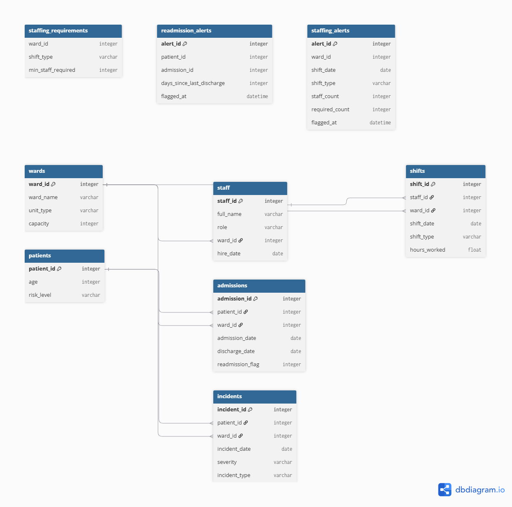

# Automated Ward Staffing System

A SQLite database modelling an NHS CAMHS ward system, with SQL triggers that
automatically flag staffing shortages and patient readmissions — no manual
checking required.

## Why this project

Ward staffing levels and 30-day readmissions are two things that normally
need a person to manually cross-check a rota or a discharge log. This
project automates both using SQL triggers, so the alerts are generated the
moment the data is entered.

## What it automates

1. **Understaffing alerts** — every time a shift is logged, a trigger
   recalculates staffing for that ward/date/shift and writes an alert if
   it's below the required minimum.
2. **Readmission detection** — every time a patient is admitted, a trigger
   checks their discharge history and automatically flags it if they were
   discharged within the last 30 days.

## Tech used

- SQLite (schema, triggers, views)
- Python (synthetic data generation only — no real patient data is used
  anywhere in this project)
- SQL concepts demonstrated: triggers, joins, CTEs, window functions,
  subqueries, aggregation

## Project structure

```
schema/       table definitions
automation/   the trigger logic (the automation layer)
seed/         Python script that generates synthetic data and builds the DB
queries/      analytical SQL queries
docs/         ERD diagram
```

## How to run it

```
git clone https://github.com/danielakbank/automated-ward-staffing-system.git
cd automated-ward-staffing-system
python seed/generate_seed.py
```

This creates `ward_system.db`, fully populated, with the triggers already
having fired on the seed data.

## Example: automation in action

After running the seed script, this query shows real alerts the system
generated on its own:

```sql
SELECT * FROM staffing_alerts LIMIT 5;
```

## Entity-relationship diagram



## Possible extensions

- A staff allocation feature (in progress) that assigns staff to shifts
  automatically, respecting break rules and maximum hours.
